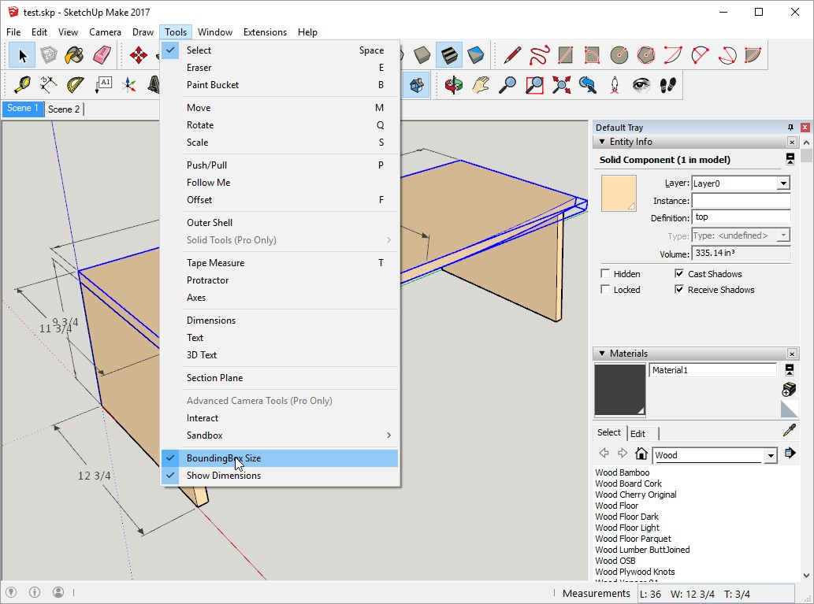

# Mobilarte : Dimensions

**Mobilarte : Dimensions** is a [SketchUp](http://www.sketchup.com) plugin which adds two options to the Tools menu.

1. **BoundingBox Size**: it displays the dimensions of components with respect to their local coordinates (red axis is length: L, green axis is width: W, blue axis is thickness: T) in the VCB (measurement box). It does not show the dimensions of a group of components, entities or groups of entities.
2. **Show Dimensions**: fast option to show/hide the dimensions in a scene.

I use this plugin to verify dimensions when using the awesome [L'Air du Bois Sketchup Toolbox](https://github.com/lairdubois/lairdubois-toolbox-sketchup-plugin).

License
-------

This code is under the **GNU GPLv3 license**.

[Read the license](LICENSE)
